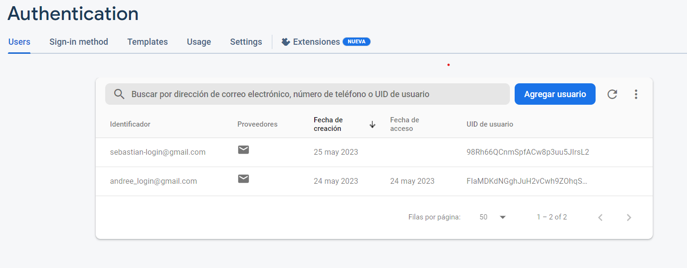
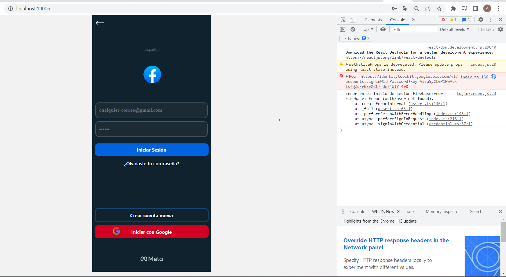
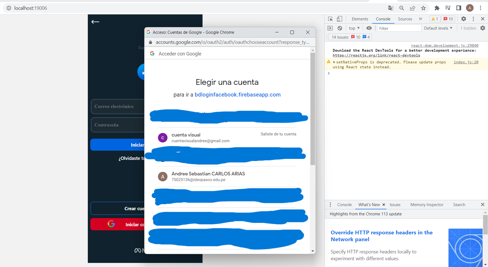
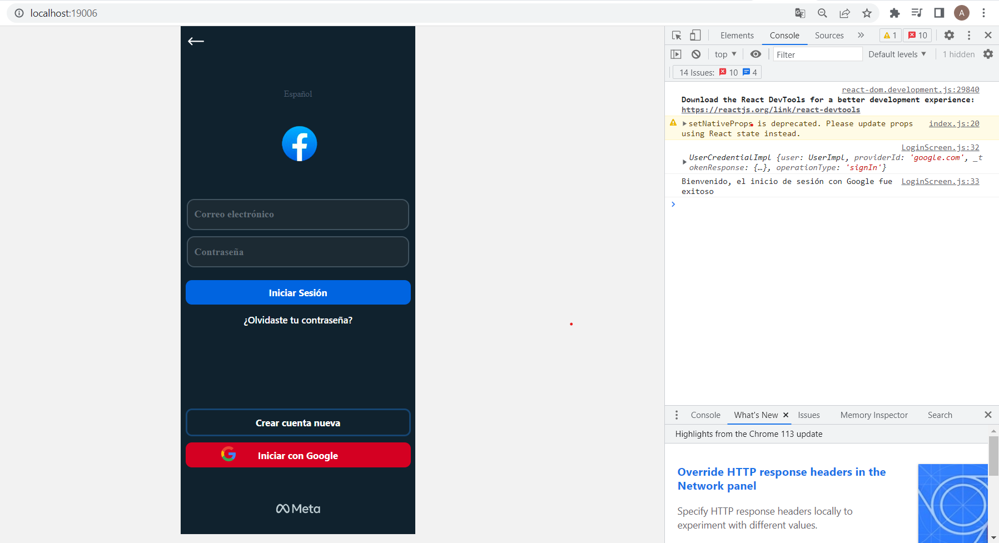
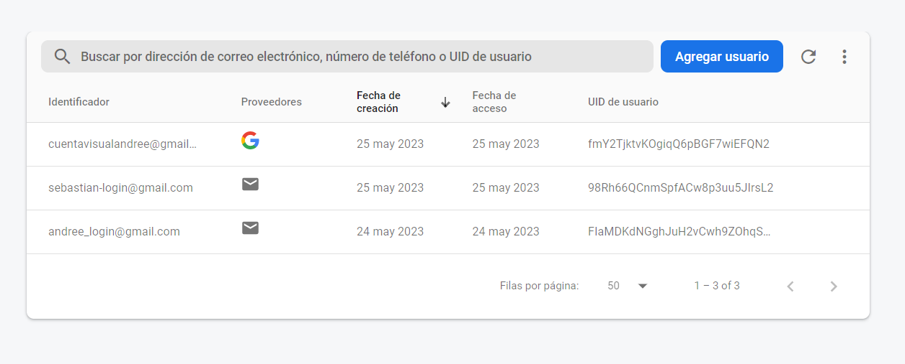
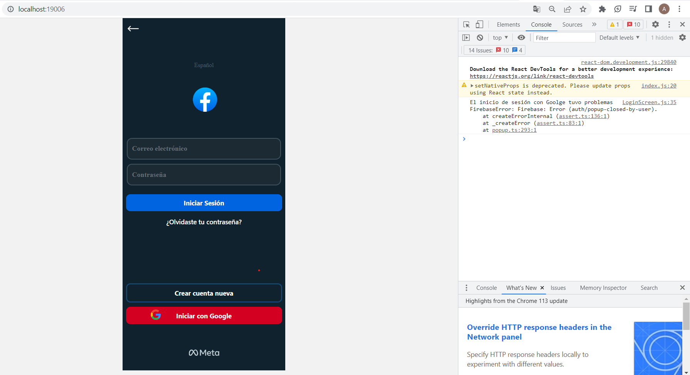
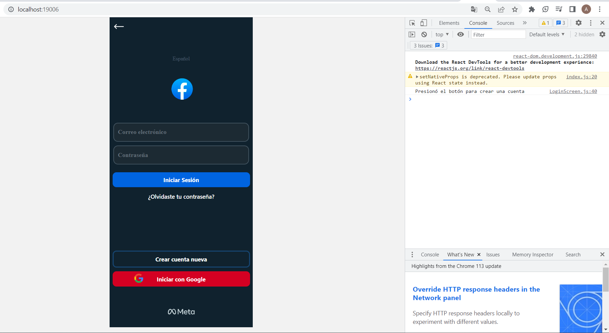

# Practica-LoginConFirebase
Este repositorio contiene un clon del login de Facebook desarrollado en React Native

## Creación del proyecto
Esta información la puede encontrar en el archivo "instructivo de montaje.txt"
- Abrimos una terminal de Command Prompt
    - Usamos el comando `npx create-expo-app --template`
    - Elegimos la opción de Proyecto en blanco
    - Le asignamos el nombre de Login-Facebook
    - Ingresamos a nuestro proyecto usando 'cd Login-Facebook'

## Instalamos las siguientes dependencias:
Esta información la puede encontrar en el archivo "instructivo de montaje.txt"
- `yarn add @react-navigation/native @react-navigation/stack firebase react-native-elements`
- `yarn add @expo/vector-icons`
- `yarn add firebase`
- `npm install --save react-navigation`
- `expo install react-native-gesture-handler react-native-reanimated react-navigation-stac`
- `expo install react-native-safe-area-view react-native-safe-area-context`
- `expo install @react-native-community/masked-view`
- `expo install react-native-screens`

## Para la autenticación con una cuenta de Google debemos intalar la siguiente dependencia:
Esta información la puede encontrar en el archivo "instructivo de montaje.txt"
- `npm install firebase react-native-google-signin`

## Diseño

Se tomó como referencia el diseño de la aplicación movil de Facebook

## Funcionamiento

### Inicio de sesión con correo y contraseña
Para autenticar con correo y contraseña debemos registrar en firebase a los usurios:

Debemos ingresar a los usuarios y sus respectivas contraseñas, en el caso de que sean correctas, mostraremos un mensaje en consola que diga "Inicio de sesión exitoso"

Si el usuario es incorrecto mostraremos un mensaje en consola que diga "Error en el inicio de sesión"

### Inicio de sesión con Google

Para autenticar con Googlo se usó un botón, el cual, al presionarlo abrirá una ventana para elegir el correo con el que queremos ingresar

Despues de elegir el correo mostrará en consola el mensaje "Bienvenido, el inicio de sesión con Google fue exitoso"

Además tambien se agregará el correo a la base de datos de firebase, para el ejemplo se accedió con la cuenta: "cuentavisualandree@gmail.com"

En el caso de que cerremos la pestaña que permite elegir el cooreo con el que queremos autenticar  mostrará en consola el mensaje "El inicio de sesión con Goolge tuvo problemas", este mensaje puede tardar unos segundos en aparecer.

### Funcione extra

El botón para crear una nueva cuenta tiene una funcionalidad muy simple, este consiste en mostrar en consola el mensaje "Presionó el botón para crear una cuenta" cada vez que sea oprimido

